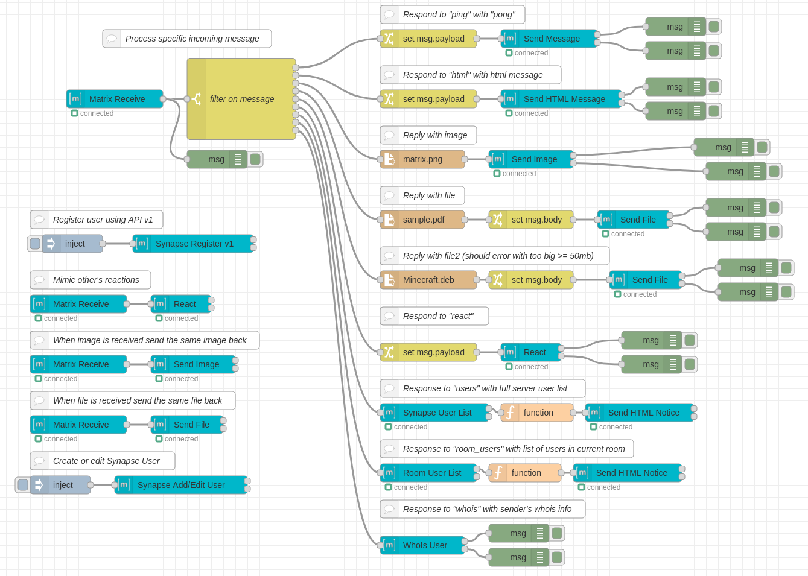

# node-red-contrib-matrix-chat
Matrix chat server client for [Node-RED](https://nodered.org/)

***Currently we are in beta. We ask that you open any issues you have on our repository to help us reach a stable well tested version. Things may change & break before our first release so check changelog before updating.***

### Features

The following is supported from this package:

- Receive events from a room (messages, reactions, images, and files)
- Send Images/Files
- Send HTML/Plain Text Message/Notice
- React to messages
- Register user's on closed registration Synapse servers using `registration_shared_secret` (Admin Only)
- List out users on a Synapse server (Admin Only)
- Get WhoIs info for a Synapse user (Admin Only)
- Add/Edit Synapse users using the v2 API (requires a pre-existing admin account)
- Get a user list from a room
- Kick user from room
- Ban user from room


Therefore, you can easily build a bot, chat relay, or administrate your Matrix server from within [Node-RED](https://nodered.org/).

### Installing

You can either install from within Node-RED by searching for `node-red-contrib-matrix-chat` or run this from within your Node-RED directory:
```bash
npm install node-red-contrib-matrix-chat
```

### Examples
We don't have examples just yet but here is a picture of my flow I use for testing this module while creating it (gives you an idea of what is possible and how easy it is to chain things):


### Usage

Using this package is very straightforward. Examples coming soon!

### Other Packages

- [node-red-contrib-gamedig](https://www.npmjs.com/package/node-red-contrib-gamedig) - Query game servers from Node-RED!

### Contributing
All contributions are welcome! If you do add a feature please do a pull request so that everyone benefits :)
Sharing is caring.