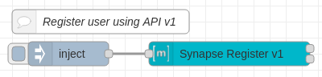

# Examples
These are examples of what is possible with the [node-red-contrib-matrix-chat](https://github.com/Skylar-Tech/node-red-contrib-matrix-chat) module for [Node-RED](https://nodered.org/)

If you want to try any of them out just copy their JSON contents from their .json file and use the hamburger menu in Node-RED to import the flow.

Build something cool with these nodes? Feel free to submit a pull request to share it!

## Index

- [Respond to "ping" with "pong"](#respond-to-ping-with-pong)
- [Respond to "html" with an HTML message](#respond-to-html-with-an-html-message)
- [Create user using Synapse v1 API](#create-user-using-synapse-v1-api)
- [Respond to "image" with an uploaded image](#respond-to-image-with-an-uploaded-image)
- [Respond to "file" with an uploaded file](#respond-to-file-with-an-uploaded-file)
- [Respond to "react" with a reaction](#respond-to-react-with-a-reaction)
- [Respond to "users" with full list of server users](#respond-to-users-with-full-list-of-server-users)

### Respond to "ping" with "pong"

[View JSON](respond-to-html-with-html.json)

Use this flow to respond to anyone that says "ping" with "pong" into the same room.

### Respond to "html" with an HTML message

[View JSON](respond-to-html-with-html.json)

Use this flow to respond to anyone that says "html" with an example HTML message. This shows how easy it is to send HTML.

### Create user using Synapse v1 API

[View JSON](create-user-synapse-v1-api.json)

Use this flow to create users on servers with closed registration. You also use this endpoint to create your first admin user as it is the same as running the local python script on the server. This requires your registration secret from your homeserver.yaml Synapse server configuration file.

Edit the object on the inject node to the user/pass combo you want to create and hit the inject button (to the left of the inject node).

**Note:** This only works on Synapse servers.

### Respond to "image" with an uploaded image

[View JSON](respond-image-with-image.json)

You will need an image on the machine running Node-RED. In this case example.png exists inside the Node-RED directory.

### Respond to "file" with an uploaded file

[View JSON](respond-file-with-file.json)

You will need a file on the machine running Node-RED. In this case sample.pdf exists inside the Node-RED directory.

### Respond to "react" with a reaction

[View JSON](respond-react-with-reaction.json)

Give a 👍 reaction when someone says "react"

### Respond to "users" with full list of server users

[View JSON](respond-users-list.json)

When someone sends the text "users" they get a HTML message back containing all the current users on the server.

This requires admin privileges.

