# Examples

These examples showcase what is possible with the [node-red-contrib-matrix-chat](https://github.com/Skylar-Tech/node-red-contrib-matrix-chat) module for [Node-RED](https://nodered.org/).

Build something cool with these nodes? Feel free to submit a pull request to share it!

## Prerequisites

- A Matrix account
- Node-RED set up and running
- Installed `node-red-contrib-matrix-chat` module

## How to Use the Examples

To try out any of the examples:

1. Copy the JSON contents from the `.json` file linked in each example.
2. In Node-RED, use the menu to import the flow:
    - Click the hamburger menu (top right corner).
    - Select **Import**.
    - Paste the JSON and click **Import**.

## Index

**Click the ▶ example to ▼ expand**

### User Management

Get or set current user display name

[View JSON](get-set-displayname.json)

This flow lets you get or set the displayname for the current user.

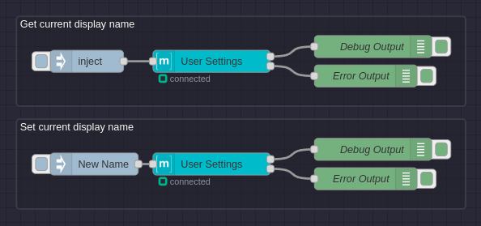

Set user avatar using URL

[View JSON](set-avatar-from-url.json)

Inject a URL to an image and Node-RED will fetch the contents, upload to matrix, then set the user avatar to the new mxc_url.

This is a good example of how to use the upload file node.

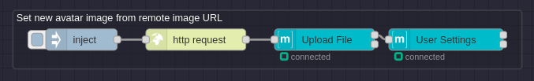

Fetch user info by userId

[View JSON](get-user.json)

Note this only works for users that the bot shares a room with. It will attempt to fetch the user from local storage first and if not found will query the server for the data.

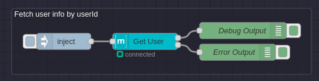

Create User with Shared Secret Registration

[View JSON](shared-secret-registration.json)

Use this flow to create users on servers with closed registration. You can also use this endpoint to create your first admin user, as it is the same as running the local Python script on the server. This requires your registration secret from your `homeserver.yaml` Synapse server configuration file.

**Instructions:**

1. Edit the object on the inject node to specify the desired username and password.
2. Click the inject button (to the left of the inject node) to create the user.

**Note:** This only works on Synapse servers.

Create/Edit Synapse User

[View JSON](add-user-with-admin-user.json)

Allows an administrator to create or modify a user account with a specified `msg.userId`.

Deactivate User

[View JSON](deactivate-user.json)

If you send "deactivate_user @test:example.com", the bot will deactivate the `@test:example.com` account on the server.

**Note:**

- This requires the bot to be a server admin.
- **WARNING:** Accounts that are deleted cannot be restored. If you want to temporarily disable a user, consider modifying the user instead.

Force User to Join Room

[View JSON](force-join-room.json)

If you send "force_join @test:example.com !320j90mf0394f:example.com", the bot will force the user `@test:example.com` into room `!320j90mf0394f:example.com`.

**Note:**

- This requires the bot to be a server admin.
- This only works for rooms on the same server.

### Message Handling

Upload file and send to room

[View JSON](send-image-to-room.json)

This flow will download an image from a given URL and upload it to the matrix server then send it to a room.

This isn't just for images and supports any sort of file format. Videos, images, and audio files will have metadata detected automatically and appended to the message (duration, dimensions, thumbnail, etc)

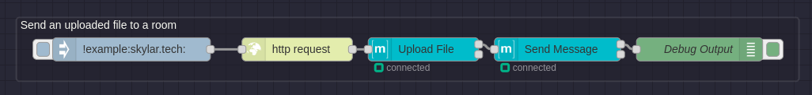

Respond to "ping" with "pong"

[View JSON](respond-ping-pong.json)

Use this flow to respond to anyone who says "ping" with "pong" in the same room.

Respond to "html" with an HTML Message

[View JSON](respond-to-html-with-html.json)

Use this flow to respond to anyone who says "html" with an example HTML message. This shows how easy it is to send HTML content.

Respond to "react" with a Reaction

[View JSON](respond-react-with-reaction.json)

Gives a 👍 reaction when someone says "react".

Remove Messages Containing "delete"

[View JSON](delete-event.json)

Any messages containing "delete" will be removed by the client.

**Note:** The bot needs appropriate permissions to remove messages.

### Event Handling

Sending Typing Events to a Room

[View JSON](send-typing-events.json)

You can indicate to a room that the bot is typing and also cancel the typing event. This can be useful for making bots feel more interactive (e.g., show typing while requesting an API endpoint).

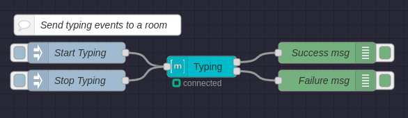

Mark all received events as read

[View JSON](mark-all-read.json)

With this flow anytime an event is received by the bot it will mark it as read.

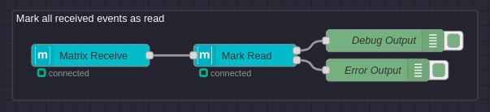

Fetch event by eventId and roomId

[View JSON](get-event.json)

Fetch an event from Matrix by eventId and roomId

**Instructions:**

- Change the inject node to contain a proper eventId and roomId (topic)
- Inject the payload and you should see the result contain the event data

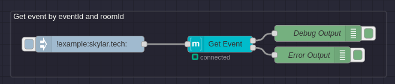

Paginate the entire history of a given room

[View JSON](paginate-room-history.json)

This flow iterates the entire history of a room (outputting for every page we hit).

There is a configurable delay (currently set at 1000ms) in this flow. This is recommended, so you are not bogging down the server.

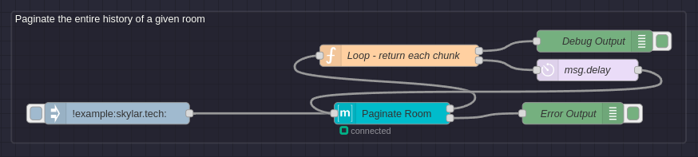

Paginate related events to a given eventId

[View JSON](fetch-event-relations.json)

Paginate through the related events to a given eventId. Related events being reactions, thread messages, message modifications, message removals, etc. This outputs once per iterated page.

If you would rather have it output one massive list at the end of pagination use this flow:
[View Aggregated Flow JSON](fetch-event-relations-aggregated.json)

**Instructions:**

- Change the inject node to contain a proper eventId and roomId (topic)
- Inject the payload and you should see the result contain a list of related events for the given eventId

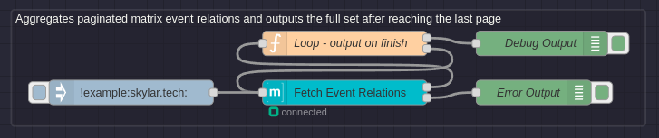

### Room Management

Set room name and topic

[View JSON](set-room-name-and-topic.json)

Changes the specified room's name and topic to the injected values.

There are a bunch of different settings you can change, this is just an example for these two fields to show how it's done.

This node can also be used to read these values.

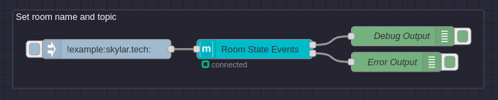

Accept Room Invites from Specific User

[View JSON](accept-room-invites.json)

Automatically accept room invites from a specific user.

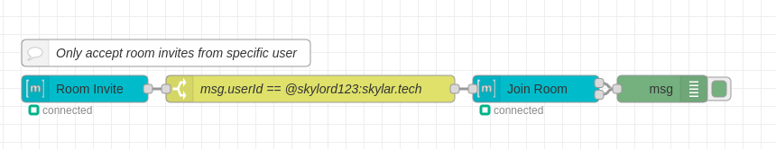

Leave Room When Someone Says "bye"

[View JSON](leave-room-bye.json)

Leaves the room when someone says "bye".

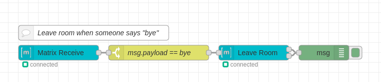

Respond to "newroom" by Creating a New Room and Inviting User

[View JSON](respond-newroom-invite.json)

When someone sends "newroom", a new room will be created, and the user who sent the message will be invited. The bot will also send a welcome message into the new room.

Respond to "joinroom &lt;room_id_or_alias&gt;" by Joining Mentioned Room

[View JSON](respond-joinroom.json)

When someone sends "joinroom &lt;room_id_or_alias&gt;", the bot will join the mentioned room.

Kick/Ban User from Room

[View JSON](room-kick-ban.json)

- If you say "kick @test:example.com", the bot will kick `@test:example.com` from the current room.
- If you say "ban @test:example.com", the bot will ban `@test:example.com` from the current room.

**Note:** This requires the bot to have permissions to kick/ban in the current room.

### User Information

Respond to "users" with Full List of Server Users

[View JSON](respond-users-list.json)

When someone sends the text "users", they receive an HTML message containing all the current users on the server. If your server has many users, this paginates and sends messages with 25 users per message.

**Notes:**

- This requires admin privileges.
- If there are many users, the bot may send multiple messages due to message size limits.

Respond to "whois &lt;user_id&gt;" with Information about the User's Session

[View JSON](respond-whois.json)

Lists out the user's session info, including IP address, last seen time, and user agent. Useful for finding out more about a specific user on your server.

**Notes:**

- This requires admin privileges.
- If the user has many sessions, the message may be too large to send in one piece.

Respond to "rooms &lt;user_id&gt;" with User's Rooms

[View JSON](respond-rooms.json)

Responds to "rooms &lt;user_id&gt;" with that user's rooms. If the message is just "rooms", it responds with a list of all rooms the server is participating in.

**Notes:**

- This requires admin privileges.
- If there are many rooms, the message may be too large to send in one piece.
- This only works for users on the current server.

Respond to "room_users" with Current Room's Users

[View JSON](respond-room-users.json)

Lists the users participating in the current room.

**Note:** If there are many users in the room, the message may be too large to send.

### Advanced Features

Use Function Node to Run Any Command

[View JSON](custom-redact-function-node.json)

If there isn't a node for something you want to do, you can use a function node to manually execute commands. For example, you can redact events (remove messages).

**Instructions:**

- Use the function node to write custom commands using the `matrix-js-sdk` client.
- Make sure to catch any errors in your function node to prevent Node-RED from crashing.

To view the available functions, check out the [`client.ts` file from `matrix-js-sdk`](https://github.com/matrix-org/matrix-js-sdk/blob/master/src/client.ts).

Download & Store All Received Files/Images

[View JSON](store-received-files.json)

Downloads received files/images. If the file is encrypted, it will decrypt it for you. The decrypt node downloads the file; otherwise, you need to use an HTTP Request node to download the file.

**Instructions:**

- You may need to edit the storage directory for this to work.
- By default, files are saved in a `downloads` folder in the Node-RED directory.
- Ensure that Node-RED has permission to write to the specified directory.

### Deprecated

Respond to "image" with an uploaded image

[View JSON](respond-image-with-image.json)

You will need an image on the machine running Node-RED. In this example, `example.png` exists inside the Node-RED directory.

**Instructions:**

1. Place the image file (`example.png`) in the appropriate directory.
2. Import the flow and deploy it.

Respond to "file" with an uploaded file

[View JSON](respond-file-with-file.json)

You will need a file on the machine running Node-RED. In this example, `sample.pdf` exists inside the Node-RED directory.

**Instructions:**

1. Place the file (`sample.pdf`) in the appropriate directory.
2. Import the flow and deploy it.

