# Examples
These are examples of what is possible with the [node-red-contrib-matrix-chat](https://github.com/Skylar-Tech/node-red-contrib-matrix-chat) module for [Node-RED](https://nodered.org/)

If you want to try any of them out just copy their JSON contents from their .json file and use the hamburger menu in Node-RED to import the flow.

Build something cool with these nodes? Feel free to submit a pull request to share it!

## Index

- [Create User with Shared Secret Registration](#create-user-with-shared-secret-registration)
- [Create/Edit Synapse User](#createedit-synapse-user)
- [Use function node to run any command](#use-function-node-to-run-any-command)
- [Respond to "ping" with "pong"](#respond-to-ping-with-pong)
- [Respond to "html" with an HTML message](#respond-to-html-with-an-html-message)
- [Respond to "image" with an uploaded image](#respond-to-image-with-an-uploaded-image)
- [Respond to "file" with an uploaded file](#respond-to-file-with-an-uploaded-file)
- [Respond to "react" with a reaction](#respond-to-react-with-a-reaction)
- [Remove messages containing "delete"](#remove-messages-containing-delete)
- [Respond to "users" with full list of server users](#respond-to-users-with-full-list-of-server-users)
- [Respond to "newroom" by creating new room and inviting user](#respond-to-newroom-by-creating-new-room-and-inviting-user)
- [Respond to "joinroom <room_id_or_alias>" by joining mentioned room](#respond-to-joinroom-room_id_or_alias-by-joining-mentioned-room)
- [Respond to "rooms <user_id>" with user's rooms (list server's rooms if <user_id> is left blank)](#respond-to-rooms-user_id-with-users-rooms-list-servers-rooms-if-user_id-is-left-blank)
- [Respond to "whois <user_id>" with information about the user's session](#respond-to-whois-user_id-with-information-about-the-users-session)
- [Respond to "room_users" with current room's users](#respond-to-room_users-with-current-rooms-users)
- [Download & store all received files/images](#download--store-all-received-filesimages)
- [Kick/Ban user from room](#kickban-user-from-room)
- [Deactivate user](#deactivate-user)

### Create user with Shared Secret Registration

[View JSON](shared-secret-registration.json)

Use this flow to create users on servers with closed registration. You also use this endpoint to create your first admin user as it is the same as running the local python script on the server. This requires your registration secret from your homeserver.yaml Synapse server configuration file.

Edit the object on the inject node to the user/pass combo you want to create and hit the inject button (to the left of the inject node).

**Note:** This only works on Synapse servers.

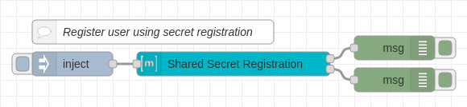

### Create/Edit Synapse User

[View JSON](add-user-with-admin-user.json)

Allows an administrator to create or modify a user account with a specified `msg.userId`.

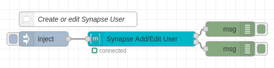

### Use function node to run any command

[View JSON](custom-redact-function-node.json)

If we do not have a node for something you want to do you can do this manually with a function node. We now have a node for removing events but this is still a good example.

**Note:** You should make sure to catch any errors in your function node otherwise you could cause Node-RED to crash.

To view what sort of functions you have access to check out the `client.ts` file from `matrix-js-sdk` [here](https://github.com/matrix-org/matrix-js-sdk/blob/master/src/client.ts).

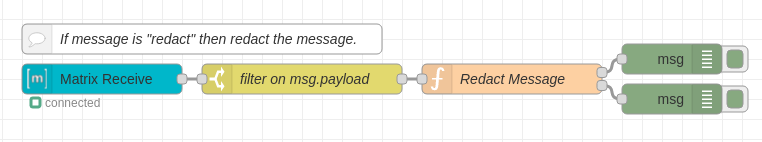

### Respond to "ping" with "pong"

[View JSON](respond-ping-pong.json)

Use this flow to respond to anyone that says "ping" with "pong" into the same room.

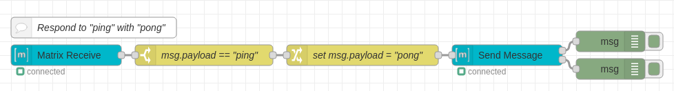

### Respond to "html" with an HTML message

[View JSON](respond-to-html-with-html.json)

Use this flow to respond to anyone that says "html" with an example HTML message. This shows how easy it is to send HTML.

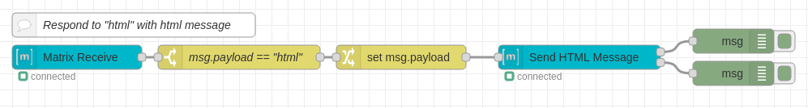

### Respond to "image" with an uploaded image

[View JSON](respond-image-with-image.json)

You will need an image on the machine running Node-RED. In this case example.png exists inside the Node-RED directory.

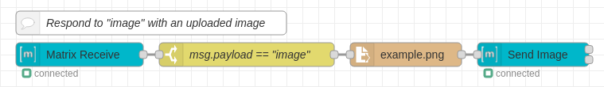

### Respond to "file" with an uploaded file

[View JSON](respond-file-with-file.json)

You will need a file on the machine running Node-RED. In this case sample.pdf exists inside the Node-RED directory.

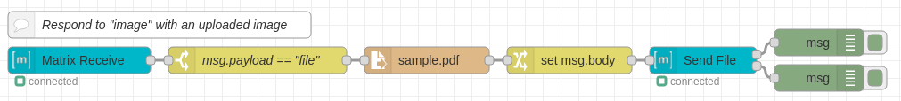

### Respond to "react" with a reaction

[View JSON](respond-react-with-reaction.json)

Give a 👍 reaction when someone says "react"

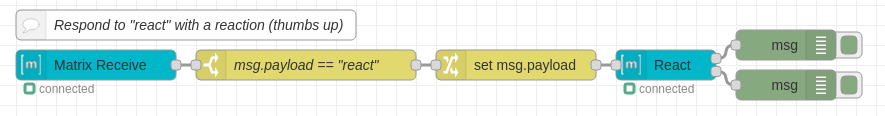

### Remove messages containing "delete"

[View JSON](delete-event.json)

Any messages containing "delete" will try to be removed by the client.

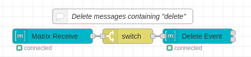

### Respond to "users" with full list of server users

[View JSON](respond-users-list.json)

When someone sends the text "users" they get a HTML message back containing all the current users on the server. If your server has a lot of users this paginates and sends a message with 25 users per message.

This requires admin privileges.

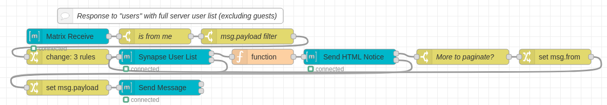

### Respond to "newroom" by creating new room and inviting user

[View JSON](respond-users-list.json)

When someone sends "newroom" a new room will be created and the user that said the message will be invited. The client will also send a welcome message into the new room.

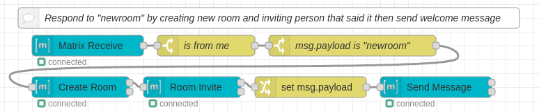

### Respond to "joinroom <room_id_or_alias>" by joining mentioned room

[View JSON](respond-joinroom.json)

When someone sends "newroom" a new room will be created and the user that said the message will be invited. The client will also send a welcome message into the new room.

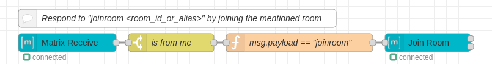

### Respond to "rooms <user_id>" with user's rooms (list server's rooms if <user_id> is left blank)

[View JSON](respond-rooms.json)

Responds to "rooms <user_id>" with that user's rooms. If the message is just "rooms" it responds with a list of all rooms the server is participating in.

Note: If there are a lot of rooms this may fail to send the message as it is too large. This also only works for user's that are on the current server.

This requires admin privileges.

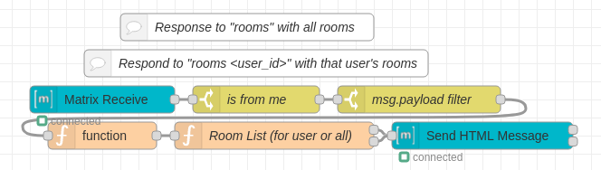

### Respond to "whois <user_id>" with information about the user's session

[View JSON](respond-whois.json)

This lists out the user's session info. Each session contains the IP address, when it was last seen, and the user agent. Useful to find out more about a specific user on your server.

Note: If there are a lot of sessions this may fail to send the message as it is too large. This also only works for user's that are on the current server.

This requires admin privileges.

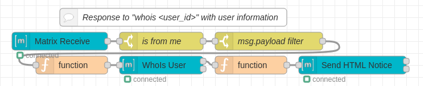

### Respond to "room_users" with current room's users

[View JSON](respond-room-users.json)

List out the users participating in a room.

Note: If there are a lot of users in the room this will fail to send due to a large message error.

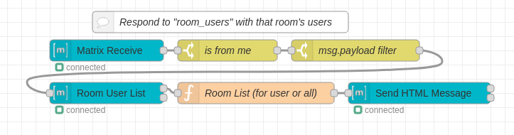

### Download & store all received files/images

[View JSON](store-received-files.json)

Download received files/images. If the file is encrypted it will decrypt it for you. The decrypt node downloads the file for you otherwise you need to use a HTTP Request node to download the file.

Note: You may need to edit the storage directory for this to work. Default action is to create a `downloads` folder in the Node-RED directory and places files in that but there is a good chance your Node-RED instance doesn't have access to write to this directory.

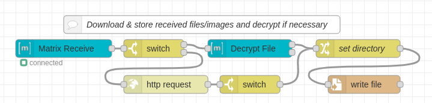

### Kick/Ban user from room

[View JSON](room-kick-ban.json)

If you say "kick @test:example.com" the bot will kick @test:example.com from the current room.

If you say "ban @test:example.com" the bot will ban @test:example.com from the current room.

Note: This requires the bot to have permissions to kick/ban in the current room.

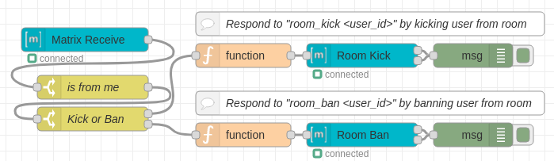

### Deactivate user

[View JSON](deactivate-user.json)

If you say "deactivate_user @test:example.com" the bot will deactivate the @test:example.com account on the server.

Note: This requires the bot to be a server admin. 

WARNING: Accounts that are deleted cannot be restored. If you want to temp-disable edit the user instead.

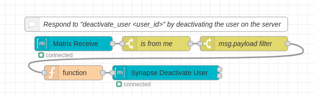

### Force user to join room

[View JSON](force-join-room.json)

If you say "force_join @test:example.com !320j90mf0394f:example.com" the bot will force the user `@test:example.com` into room `!320j90mf0394f:example.com`

Note: This requires the bot to be a server admin. This also only works for rooms on the same server.

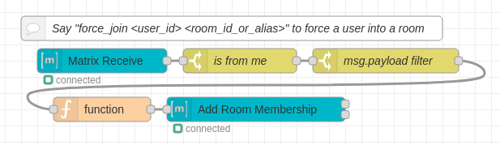